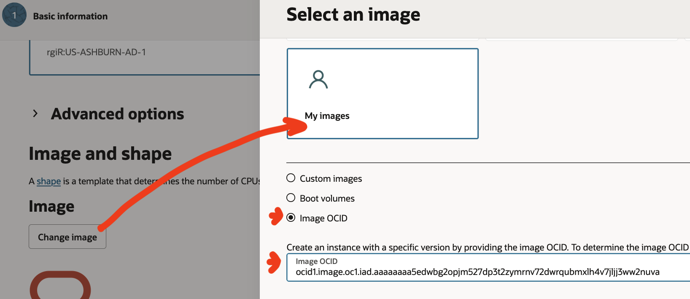
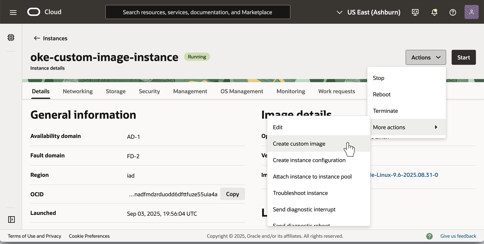
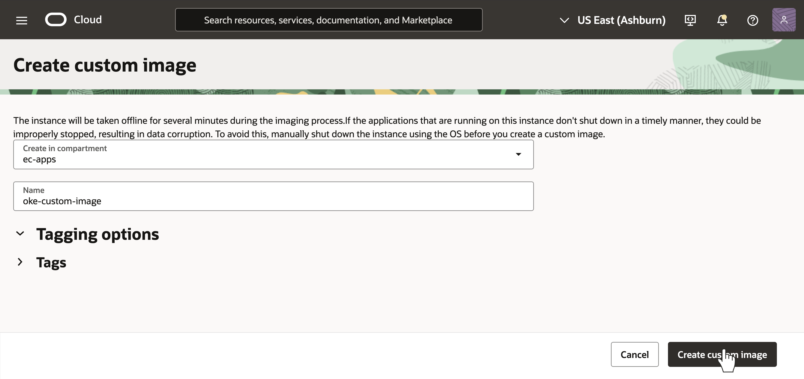
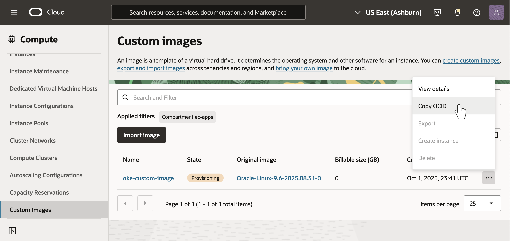

# Create a Custom Operating System Image for OKE Node Pools
If you've tried to create a custom image for your node pools and run into issues of nodes not joining the cluster properly, nodes taking a long time to spin up, or you're just not sure how to make a custom image for your OKE node pools, this guide should help you.

This is a guide on how to make custom images for OKE node pools using platform images. It's not meant to be comprehenvise, but to outline the basic steps with console, cli, and terraform options for you to follow.

### Prerequisites:
 * OCI CLI Installed and configured
 * An Existing OKE Cluster
 * Familiarity with the OCI Console and OCI Command Line Interface
 * Familiarity with either Oracle Linux or Ubuntu
 * (optional) Familiarity with the OCI Terraform Provider

## 1. Find a suitable platform image using the oci cli
Using the command line and the OCI CLI, let's find an existing OKE platform image we can use as a base.

### For all x86 (AMD and Intel Shapes)
```bash
oci ce node-pool-options get --node-pool-option-id all | jq '.data.sources[] | select(."source-name" | test("GPU|aarch") | not )'
```

### For all ARM images
```bash
oci ce node-pool-options get --node-pool-option-id all | jq '.data.sources[] | select(."source-name" | contains("aarch"))'
```

### For GPU images

```bash
oci ce node-pool-options get --node-pool-option-id all | jq '.data.sources[] | select(."source-name" | contains("GPU"))'
```

### Example: 
Find the most recent image for AMD that runs Kubernetes 1.33.1 on Oracle Linux 8.10:

```bash
oci ce node-pool-options get --node-pool-option-id all | jq '.data.sources[] | select(."source-name" | test("GPU|aarch") | not ) | select(."source-name" | contains("8.10") and contains("1.33.1"))' | head -n 5
# Get a list of all OKE platform images and query the image source name for anything not containing "GPU" or "aarch" that has Oracle Linux 8.10 for Kubernetes v1.33.1. Just the first 5 lines (first record)
{
  "image-id": "ocid1.image.oc1.iad.aaaaaaaa5edwbg2opjm527dp3t2zymrnv72dwrqubmxlh4v7jljj3ww2nuva",
  "source-name": "Oracle-Linux-8.10-2025.08.31-0-OKE-1.33.1-1191",
  "source-type": "IMAGE"
}
```

I can then note the OCID for the platform image I want to use as a base for my custom image:

`ocid1.image.oc1.iad.aaaaaaaa5edwbg2opjm527dp3t2zymrnv72dwrqubmxlh4v7jljj3ww2nuva`

## 2. Create an Instance using this ocid

### Console
You can do this in the console by selecting My Images 


### OCI CLI

`oci compute instance launch ... --image-id ocid1.image.oc1.iad.aaaaaaaa5edwbg2opjm527dp3t2zymrnv72dwrqubmxlh4v7jljj3ww2nuva`

### Terraform

```terraform
resource "oci_core_instance" "test_instance" {
    ...
    source_details {
        source_id = "ocid1.image.oc1.iad.aaaaaaaa5edwbg2opjm527dp3t2zymrnv72dwrqubmxlh4v7jljj3ww2nuva"
        source_type = "image"
    ...
    }
    preserve_boot_volume = false
}
```
Don't forget to leave yourself a means of entry (i.e. bastions, ssh public key, etc.)

Note the OCID for the instance for the next step.

## 3. Configure the host with your specific needs
Typically you can log into this instance, and install/configure the operating system. DO NOT do this from an existing OKE node as the resulting custom image will already be configured as an OKE node, and the automation OKE uses to join the node to the node pool will break.

### Example
Update the OS, install the oci cli, and oracle developer packages.
```bash
ssh -i /path/to/ssh/private/key opc@hostipaddress
[opc@hostname ~]$ sudo dnf update -y
...
[opc@hostname ~]$ sudo dnf install python36-oci-cli oraclelinux-developer-release-el8 -y
```

## 4. Create a custom image from the instance
Now that the node instance is configured, let's capture it for use in our custom node pool.

### Console
From the instance Actions menu select create custom image

Select the compartment and name the custom image, click create custom image

Select Custom Images from the Compute menu on the left and copy the ocid of the custom image


### OCI CLI

```bash 
oci compute image create --compartment-id ocid.of.the.oke.cluster.compartment --display-name "oke-custom-image" --instance-id ocid.from.step.2

# Retrieve the ocid for the image
oci compute image list --compartment-id ocid.of.the.oke.cluster.compartment --display-name "oke-custom-image" | jq '.data[].id'
```

### Terraform

```terraform
resource "oci_core_image" "oke-custom-image" {
    compartment_id = ocid.of.the.oke.cluster.compartment
    instance_id = ocid.from.instance.created.in.step.2
    display_name = "oke-custom-image"
}
```
Grab the `id` of the image from the output.

## 5. Create a node pool from the image
This step requires use of the OCI CLI or Terraform

### OCI CLI
```bash
oci ce node-pool create \
--cluster-id ocid.of.the.oke.cluster \
--compartment-id ocid.of.the.compartment.for.the.node.pool \
--name "oke-node-pool" \
--kubernetes-version v1.33.1 \
--node-shape VM.Standard.E5.Flex \
--node-shape-config '{"ocpus": 16, "memoryInGbs": 64}' \
--size 3 \
--placement-configs '[{"availabilityDomain": "rgIR:US-SANJOSE-1-AD-1", "subnetId": "ocid.of.the.oke.node.subnet"}]' \
--pod-subnet-ids '["ocid.of.the.oke.pod.subnet"]' \
--node-image-id ocid.of.the.image.from.step.4
```

### Terraform

```terraform
resource "oci_containerengine_node_pool" "custom_node_pool" {
  cluster_id = ocid.of.the.cluster
  compartment_id = ocid.of.the.oke.cluster.compartment
  name = "custom-node-pool"
  node_shape = "VM.Standard.E5.Flex"
...
  node_image_name = oci_core_image.test_image.name
  node_source_details {
    image_id = oci_core_image.test_image.id
    source_type = "IMAGE"
  }
...
}
